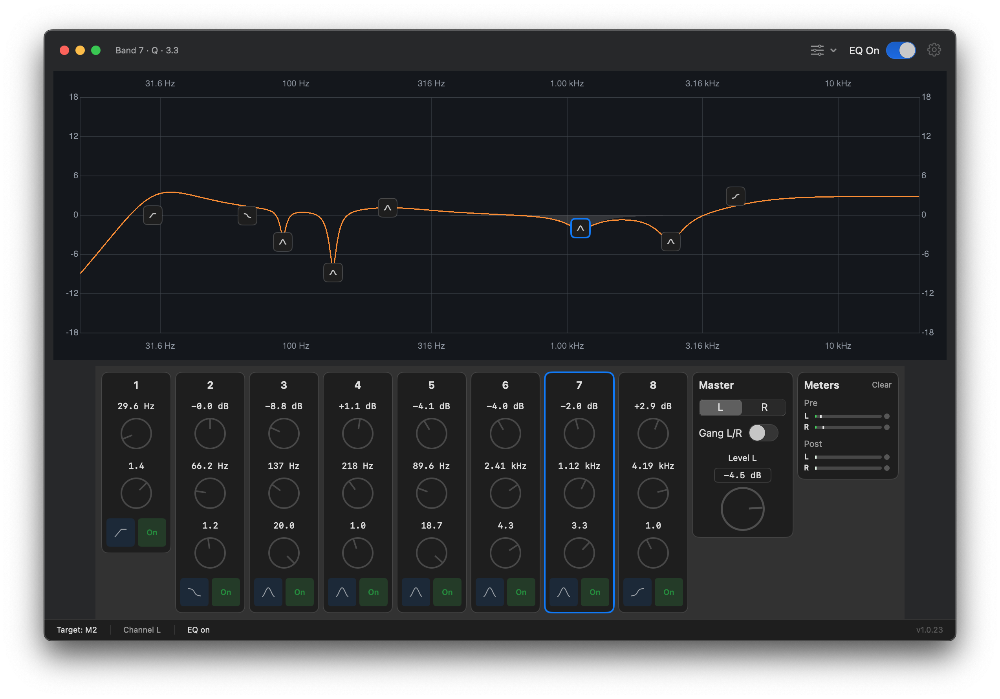

# Parametrique

macOS virtual audio driver and app with an 8-band per-channel parametric EQ. The UI is recognizable to sound engineers and audio enthusiasts alike.

Parametrique proxies system audio to your speakers or interface and processes it using proven DSP math. EQ settings persist after you quit the app — reopen it only when you want to change them.

This repository is the public **download site and release channel** for Parametrique — installers, documentation, and the GitHub Pages site. It does not contain the app or driver source code.

**[Download the latest release →](https://sound-eng.github.io/parametrique-web/)**

Requires **macOS 14.6 or later**.

## Quick start

1. Download and open `Parametrique-<version>.pkg` from the [download page](https://sound-eng.github.io/parametrique-web/).
2. In **System Settings → Sound**, select **Parametrique EQ Device** as output.
3. Launch **Parametrique** from `/Applications`.
4. Open **Parametrique → Settings** and choose your speakers or interface under **Proxied device**.

## Using the app

| Main window | Settings (Parametrique → Settings) |
|-------------|-------------------------------------|
| 8-band EQ, live response graph, L/R ganging, bypass | Proxied device, buffer size, driver options |
| Changes apply to the driver immediately | Export Diagnostics when troubleshooting |

- **EQ** — adjust bands in the main window; settings stay active after you quit.
- **Proxied device** — pick the physical output you want to hear. Without this, audio routes to the first device in the list.
- **No sound?** — confirm the proxied device is set and raise **Parametrique EQ Device** level in Audio MIDI Setup.
- **Crackling?** — increase buffer size in Settings.

## Install

A step-by-step install guide is on the site: [install guide](https://sound-eng.github.io/parametrique-web/install.html).

## Uninstall

1. Remove the driver — **Parametrique → Settings → Driver → Uninstall…** (or delete `Parametrique.driver` manually from `/Library/Audio/Plug-Ins/HAL/`).
2. Restart Core Audio if you deleted the driver manually: `sudo launchctl kickstart -k system/com.apple.audio.coreaudiod`
3. Delete **Parametrique** from `/Applications`.

